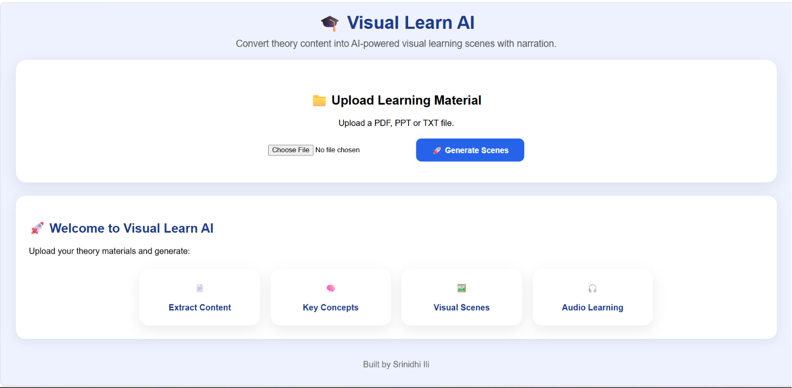
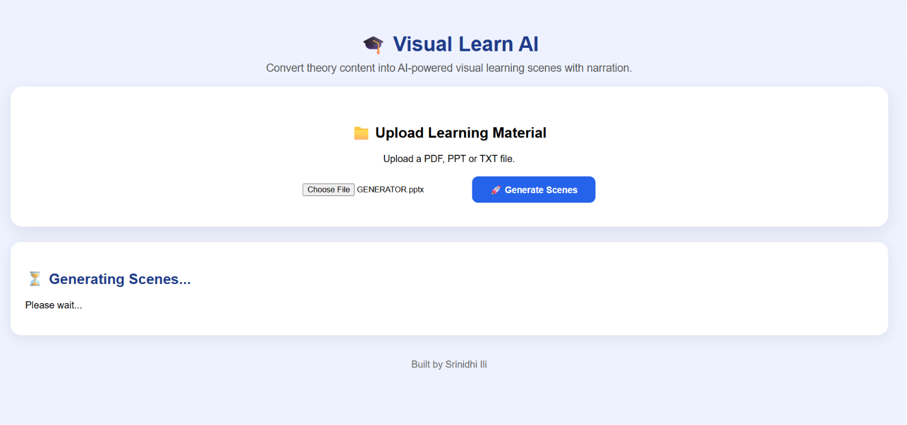
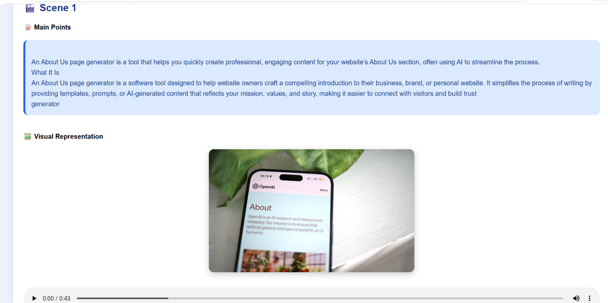
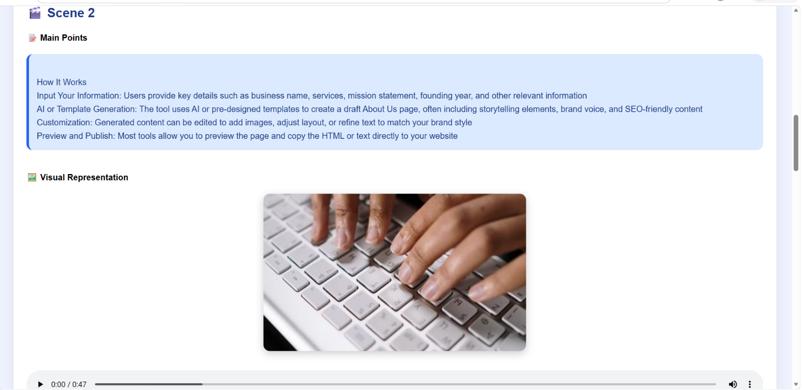

# 🎓 Visual Learn AI

An AI-powered educational platform that converts PDF, PPT, and TXT learning materials into visual learning scenes with AI-generated images and voice narration.

---

## 📌 Problem Statement

Traditional learning materials are often text-heavy and difficult to understand quickly. Students spend significant time reading long theoretical content without visual support.

Visual Learn AI transforms educational content into visual scenes with narration, helping students learn concepts faster and more effectively.

---

## 🚀 Features

### 📄 Content Extraction

* Extracts text from PDF files
* Extracts content from PowerPoint presentations
* Supports TXT documents

### 🧠 Smart Content Processing

* Separates content slide-by-slide
* Preserves educational structure
* Generates scene-wise learning content

### 🖼️ AI Visual Generation

* Generates relevant visual representations
* Creates image-based learning support

### 🎧 Voice Narration

* Converts educational content into speech
* Generates audio for every scene
* Improves accessibility and engagement

### 🎬 Scene-Based Learning

* Organizes content into individual scenes
* Displays text, image, and narration together

---

## 🏗️ System Workflow

1. Upload PDF / PPT / TXT file
2. Extract educational content
3. Split content into scenes
4. Generate relevant images
5. Generate narration audio
6. Display interactive visual learning scenes

---

## 🛠️ Technology Stack

### Frontend

* HTML
* CSS
* JavaScript

### Backend

* Python
* Flask
* Flask-CORS

### AI & Processing

* Pexels API
* Text-to-Speech
* PyPDF2
* python-pptx

---

## 📂 Project Structure

visual_learn_ai/

├── backend/

│ ├── app.py

│ ├── scene_generator.py

│ ├── ppt_reader.py

│ ├── pdf_reader.py

│ ├── text_to_speech.py

│ ├── storyboard_generator.py

│ └── uploads/

│

├── frontend/

│ ├── index_new.html

│ ├── style.css

│ └── script.js

│

└── README.md

---

## ⚙️ Installation

### Clone Repository

git clone https://github.com/srinidhi-ili/Visual-Learn-AI-Full.git

cd Visual-Learn-AI-Full

### Install Dependencies

pip install -r backend/requirements.txt

### Configure Environment Variables

Create a `.env` file inside the backend folder:

PEXELS_API_KEY=YOUR_API_KEY

### Run Backend

cd backend

python app.py

### Open Frontend

Open:

frontend/index_new.html

in your browser.

---

## 📸 Screenshots

### Upload Interface

### Generated Learning Scene

### Audio Narration

### Video Generation

---
## 🎥 Demo Video

Watch the project demonstration:

[Visual Learn AI Demo](https://drive.google.com/file/d/1rHDGksxXhptW-DbPFCZwZBgYECfxx_t0/view?usp=sharing)
---

## 👨‍💻 Author

Srinidhi Ili

B.Tech CSE (AI & ML)

Visual Learn AI Project

---

## ⭐ Acknowledgements

* Flask
* Pexels API
* PyPDF2
* python-pptx
* Open Source Community
* 
